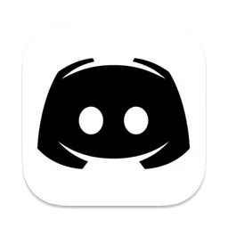

<div align="center">
  
  <h1>Fullstack Discord Clone</h1>
  <p>A feature-rich Discord clone built with Next.js, Socket.io, Prisma, and Tailwind CSS.</p>
</div>

## ✨ Features

-   **Real-time Messaging**: Socket.io powered chat.
-   **Servers & Channels**: Create and customize servers and channels (Text,
    Audio, Video).
-   **Authentication**: Secure login via Clerk.
-   **File Uploads**: Image and PDF sharing using UploadThing.
-   **Video/Audio Calls**: Integrated signaling for voice and video features.
-   **Responsive Design**: Modern UI with Light/Dark mode support.

## 🛠️ Tech Stack

-   **Framework**: Next.js 16 (App Router)
-   **Language**: TypeScript
-   **Database**: PostgreSQL (Prisma ORM)
-   **Styling**: Tailwind CSS & Shadcn/ui
-   **State Management**: Zustand & React Query
-   **Real-time**: Socket.io

## 🚀 Getting Started

### 1. Clone the repository

```bash
git clone <repository-url>
cd discord-fullstack
```

### 2. Install dependencies

```bash
npm install
```

### 3. Setup Environment Variables

Create a `.env` file in the root directory and add the following keys:

```env
DATABASE_URL=
NEXT_PUBLIC_CLERK_PUBLISHABLE_KEY=
CLERK_SECRET_KEY=
NEXT_PUBLIC_CLERK_SIGN_IN_URL=
NEXT_PUBLIC_CLERK_SIGN_UP_URL=
NEXT_PUBLIC_CLERK_AFTER_SIGN_IN_URL=
NEXT_PUBLIC_CLERK_AFTER_SIGN_UP_URL=
UPLOADTHING_SECRET=
UPLOADTHING_APP_ID=
LIVEKIT_API_KEY=
LIVEKIT_API_SECRET=
NEXT_PUBLIC_LIVEKIT_URL=
```

### 4. Setup Database

```bash
npx prisma generate
npx prisma db push
```

### 5. Run the application

```bash
npm run dev
```

Open [http://localhost:3000](http://localhost:3000) to view it in the browser.
